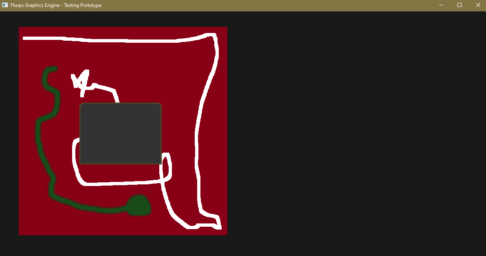

# Flurps Engine written in C from scratch.
  
This setup at this time is for Windows builds. But will add Linux builds later.  
  
Currently only proven to work on Windows 10. 
  
NOTE : Makefile has been included.  
  
GCC / MinGW x64 11.2  
https://nuwen.net/mingw.html  
  
To view current status, visit the Trello page.  
https://trello.com/b/mJqOCTk2/flurps-engine  
  
  
At this time, the node in this picture is dragable, and it stays put when you release the mouse.  
  